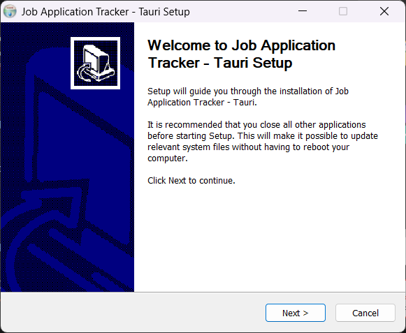
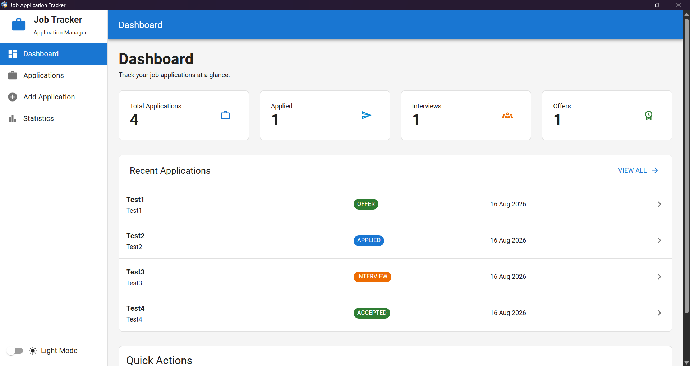
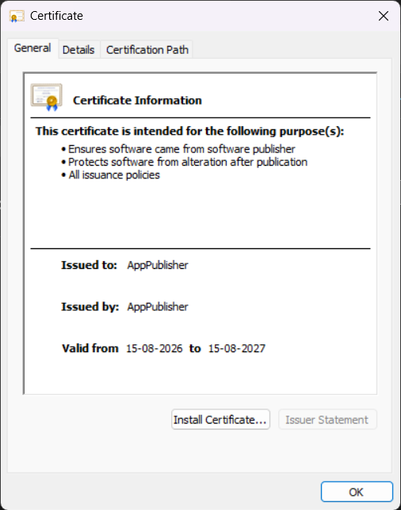
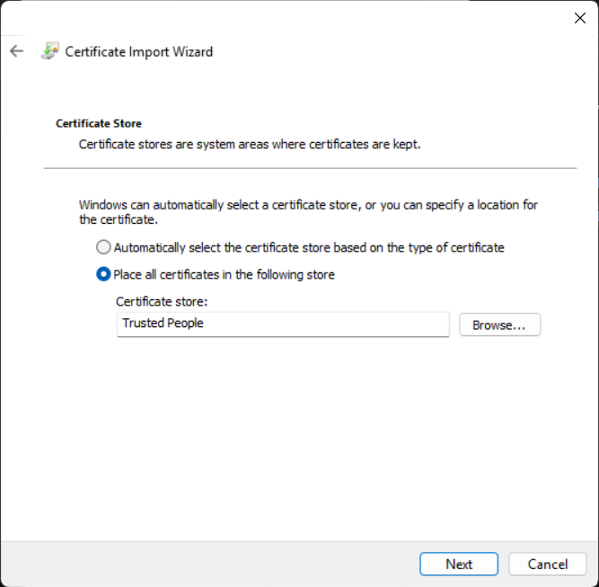

# Job Application Tracker Desktop

A desktop application built around the existing Job Application Tracker backend and React frontend.

The repository provides orchestration scripts for cloning, updating, building, cleaning, running, and packaging the application with Electron.

## Desktop Application Builds

The Job Application Tracker is packaged as a standalone Windows desktop application using multiple desktop technologies.

### Desktop Builds

| Application | Description | Download |
|---|---|---|
| **Electron** | Electron desktop shell with React frontend and Spring Boot backend | [Windows Installer](https://github.com/SAHIL-VARTAK/Job-Application-Tracker-Desktop/releases/download/desktop-showcase/Job-Application-Tracker-Electron-Setup-1.0.0.exe) |
| **Tauri** | Rust-based desktop shell with the same React frontend and Spring Boot backend | [Windows Installer](https://github.com/SAHIL-VARTAK/Job-Application-Tracker-Desktop/releases/download/desktop-showcase/Job.Application.Tracker.-.Tauri_1.0.0_x64-setup.exe) |
| **WPF** | Windows desktop application using .NET and WebView2 | [Windows Installer](https://github.com/SAHIL-VARTAK/Job-Application-Tracker-Desktop/releases/download/desktop-showcase/JobApplicationTracker-WPF-Setup.exe) |
| **WinUI 3** | Modern Windows desktop application using .NET and WebView2 | [Windows Installer](https://github.com/SAHIL-VARTAK/Job-Application-Tracker-Desktop/releases/download/desktop-showcase/JobApplicationTracker-WinUI3-Setup.exe) |
| **WinUI 3 Single-File** | Self-contained single-file WinUI 3 deployment | [Windows Installer](https://github.com/SAHIL-VARTAK/Job-Application-Tracker-Desktop/releases/download/desktop-showcase/JobApplicationTracker-WinUI3-SingleFile-Setup.exe) |
| **WinUI 3 MSIX** | MSIX package signed with a development certificate | [MSIX Package](https://github.com/SAHIL-VARTAK/Job-Application-Tracker-Desktop/releases/download/desktop-showcase/WinUI3_1.0.0.0_x64.msix) |

**[View all desktop builds and release assets](https://github.com/SAHIL-VARTAK/Job-Application-Tracker-Desktop/releases/tag/desktop-showcase)**

> **MSIX:** The MSIX package is signed with a development certificate and may require certificate trust configuration on other Windows machines.

### Installation Walkthrough

1. Download the installer from the **Desktop Builds** table above.
2. Run the downloaded `.exe` installer. Windows SmartScreen may display a warning because the application uses a development certificate.
3. Select **More info → Run anyway** to continue.
4. Follow the setup wizard and complete the installation.

   

5. Launch **Job Application Tracker** from the desktop shortcut or Start Menu.

   

6. The application starts with the bundled React frontend, Spring Boot backend, and required runtime components.
7. To uninstall the application, open the application's installation folder and run the **Uninstall** executable.

### Installing the MSIX Package

The MSIX package is signed with a development certificate. On a machine where this certificate is not already trusted, install the certificate before installing the MSIX package.

1. Download the [Job Application Tracker development certificate](dotnet/scripts/JobApplicationTracker-Dev.cer).
2. Open `JobApplicationTracker-Dev.cer` and select **Install Certificate...**.

   

3. Select **Local Machine** and click **Next**. Windows may request administrator permission.
4. Select **Place all certificates in the following store** and click **Browse...**.
5. Select **Trusted People**, click **OK**, then click **Next**.

   

6. Click **Finish** to complete the certificate installation.
7. Download and open the **WinUI 3 MSIX Package** from the [Desktop Builds](#desktop-builds) table above.
8. The MSIX package can now be installed normally.

## Project Structure

```text
JobApplicationTrackerDesktop/
├── orchestrator.sh
├── electron/
│   └── ...
└── workspace/
    ├── Job-Application-Tracker/
    └── Job-Application-Tracker-UI/
```

The `workspace` directory contains the backend and frontend repositories cloned by the root orchestrator.

## Prerequisites

Install:

- Git
- Node.js
- npm
- JDK 22

Verify:

```bash
git --version
node --version
npm --version
java -version
```

JDK 22 is required for the Electron build because a custom Java runtime is created using `jlink`.

# Manual Setup

## Clone the Backend

From the project root:

```bash
mkdir -p workspace
git clone https://github.com/SAHIL-VARTAK/Job-Application-Tracker.git workspace/Job-Application-Tracker
```

## Clone the Frontend

```bash
git clone https://github.com/SAHIL-VARTAK/Job-Application-Tracker-UI.git workspace/Job-Application-Tracker-UI
```

## Build the Backend

```bash
cd workspace/Job-Application-Tracker
chmod +x mvnw
./mvnw clean package
```

The JAR is generated under:

```text
workspace/Job-Application-Tracker/target/
```

## Build the Frontend

```bash
cd ../Job-Application-Tracker-UI
npm ci
npm run build
```

The production frontend is generated under:

```text
workspace/Job-Application-Tracker-UI/dist/
```

# Root Orchestrator

Make the orchestrator executable if necessary:

```bash
chmod +x orchestrator.sh
```

## Clone

Clone both repositories:

```bash
./orchestrator.sh clone
```

## Update

Pull the latest changes from both repositories:

```bash
./orchestrator.sh update
```

## Build

Build the backend JAR and frontend production bundle:

```bash
./orchestrator.sh build
```

## Clean

Remove the complete `workspace/` directory:

```bash
./orchestrator.sh clean
```

This removes the cloned backend and frontend repositories and all of their generated files.

# Electron Desktop Application

The Electron implementation packages the existing React frontend and Spring Boot backend into a standalone Windows desktop application. It includes the Electron desktop shell, production React frontend, Spring Boot backend JAR, custom Java 22 runtime created with `jlink`, per-user SQLite database, startup splash and error screens, hidden backend console window, and Windows NSIS installer.

For the complete Electron-specific architecture, setup, runtime creation, startup process, packaging, and troubleshooting details, see the [Electron README](electron/README.md).

# Tauri Desktop Application

The Tauri implementation packages the existing React frontend and Spring Boot backend into a standalone Windows desktop application. It includes the Tauri desktop shell, production React frontend, Spring Boot backend JAR, custom Java 22 runtime created with `jlink`, per-user SQLite database, startup splash and error screens, hidden backend console window, and Windows NSIS installer.

For the complete Tauri-specific architecture, setup, runtime creation, startup process, packaging, and troubleshooting details, see the [Tauri README](tauri/README.md).

# .NET Desktop Application

The .NET implementation packages the existing React frontend and Spring Boot backend into Windows desktop applications using WPF and WinUI 3. It includes WPF and WinUI 3 desktop hosts, production React frontend, Spring Boot backend JAR, custom Java 22 runtime created with `jlink`, WebView2 integration, self-contained publishing, WinUI 3 single-file publishing, MSIX packaging, and Inno Setup installers.

For the complete .NET-specific architecture, setup, frontend and backend resource preparation, WPF and WinUI 3 development, publishing, MSIX packaging, installer configuration, and orchestration details, see the [.NET README](dotnet/README.md).

# Complete Setup Using the Root Orchestrator

For a fresh checkout:

```bash
./orchestrator.sh clone
./orchestrator.sh build
./orchestrator.sh electron-start
```

To create the Windows installer:

```bash
./orchestrator.sh electron-package
```

# Updating

Update the backend and frontend repositories:

```bash
./orchestrator.sh update
```

Rebuild them:

```bash
./orchestrator.sh build
```

Then start Electron:

```bash
./orchestrator.sh electron-start
```

Or create a new installer:

```bash
./orchestrator.sh electron-package
```

# Electron Installer

The Windows installer is generated under:

```text
electron/release/
```

The distributable file is:

```text
Job-Application-Tracker-Electron-Setup-<version>.exe
```

The installer contains the required Electron application, frontend, backend, and custom Java runtime.

The end user does not need to install:

- Java/JDK
- Node.js
- npm
- Maven
- the backend repository
- the frontend repository

The bundled Java runtime is used to run the Spring Boot backend.

# Tauri Installer

The Windows installer is generated under:

```text
tauri/src-tauri/target/release/bundle/nsis/
```

The distributable file is:

```text
Job Application Tracker - Tauri_<version>_x64-setup.exe
```

The installer contains the required Tauri application, production frontend, backend, and custom Java 22 runtime.

The end user does not need to install:

* Java/JDK
* Node.js
* npm
* Maven
* the backend repository
* the frontend repository

The bundled Java runtime is used to run the Spring Boot backend.

# .NET Installer

The Windows installers are generated under:

```text
dotnet/publish/installers/
```

The distributable files include:

```text
JobApplicationTracker-WPF-Setup-<version>.exe
JobApplicationTracker-WinUI3-Setup-<version>.exe
JobApplicationTracker-WinUI3-SingleFile-Setup-<version>.exe
```

The installers contain the required .NET desktop application, production frontend, backend, and custom Java 22 runtime.

The end user does not need to install:

- Java/JDK
- Node.js
- npm
- Maven
- the backend repository
- the frontend repository

The bundled Java runtime is used to run the Spring Boot backend.

The WinUI 3 implementation also supports MSIX packaging separately.

# Application Data

The installed application stores its SQLite database under:

```text
%APPDATA%\job-application-tracker-electron\data\job_tracker.db
```

Application data is intentionally preserved when the application is uninstalled.

# Current Result

The Windows applications are successfully packaged with approximate sizes:

Electron:
```text
Windows installer:       ~200 MB
Installed application:   ~450 MB
Installer name:          Job-Application-Tracker-Electron-Setup-<version>.exe
```

Tauri:
```text
Windows installer:       ~100 MB
Installed application:   ~130 MB
Installer name:          Job Application Tracker - Tauri_<version>_x64-setup.exe
```

.NET:
```text
Windows installer:       ~150 MB
Installed application:   ~250 MB
Installer name:          JobApplicationTracker-<platform>-Setup-<version>.exe
```

Notes:

- Electron packaging is straightforward and requires minimal setup, making it easier to get started quickly.
- Tauri produces significantly smaller installers and installed sizes, but the setup process is more involved. It requires additional configuration and custom Rust integrations to achieve the desired functionality.
- .NET provides a moderate setup experience. Adding the desktop wrapper is relatively straightforward, while creating distributable installers requires additional software such as Inno Setup.
- The installers are compressed, while the installed applications contain the extracted application files.

### GitHub Actions

The desktop applications are built independently using GitHub Actions, allowing Electron, Tauri, and .NET builds to run in parallel.

**Build Times**
- Electron: approximately **4 minutes**
- .NET: all four installers completed within approximately **8 minutes total**
- Tauri: approximately **20 minutes**
- [View the GitHub Actions build](https://github.com/SAHIL-VARTAK/Job-Application-Tracker-Desktop/actions/runs/31953337151/job/95180089982)
